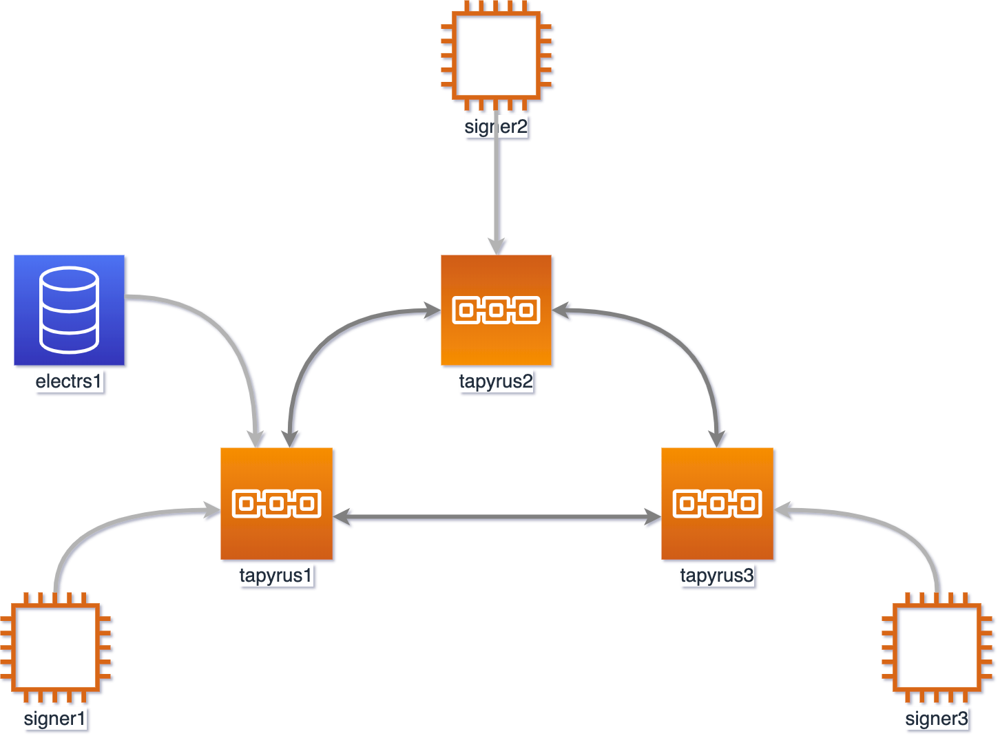

# Tapyrus Docker

Dockerfile for tapyrus core, tapyrus signer, electrs-tapyrus,...

# Usage

```

git clone https://github.com/Yamaguchi/tapyrus-docker

cd tapyrus-docker

docker-compose build

docker-compose up -d redis tapyrus1 tapyrus2 tapyrus3

(wait for a minites, during initial block download(IBD) on tapyrus core)

docker-compose up -d signer1 signer2 signer3 electrs1

(below is for debug using bitcoinrb)
docker-compose up -d client

(wait until 100 blocks generated...)

```

Then instances below will wake up.

- Tapyrus Core: 3
- Tapyrus Signer: 3
- Redis: 1
- Electrs for Tapyrus: 1
- RPC Client for debug(only bitcoinrb installed): 1



# Compatible versions

| Core   | Signer | Electrs |
| ------ | ------ | ------- |
| v0.3.0 | v0.3.0 | v0.1.0  |
| v0.4.0 | v0.4.0 | v0.2.0  |

# How To Generate Private Keys and Genesis Block

The following describes how to generate private keys and genesis block.
It is not recommended on production because the trusted dealer is needed, but is useful on development

1. Run ruby client as a docker container.

```

> docker-compose up -d client
> docker-compose exec client bash

```

2. Start ruby console

```

> ./bin/console

```

3. Generate keys.These keys will be set to arguments of signer.

```

irb(main):001:0> Bitcoin.chain_params = :regtest
=> :regtest
irb(main):002:0> k1 = Bitcoin::Key.generate
irb(main):003:0> k2 = Bitcoin::Key.generate
irb(main):004:0> k3 = Bitcoin::Key.generate

irb(main):005:0> k1.to_wif
=> "cMh9g7zNNJWJp9fPk1DmbkZeQPfk6MG8QCNKYW4tgxTVaZ6H9Aej" # (1) private key of signer1

irb(main):006:0> k2.to_wif
=> "cVDzZsyvNcDxS9SKS9y8PrAhjaBu4fYTbp5wYreufD9dhfCYFBBn" # (2) private key of signer2

irb(main):007:0> k3.to_wif
=> "cPXucqZggKjhx6k3zdNQz2tGDwQYYwpPMakCnba4QYGsmThwSFc4" # (3) private key of signer3

irb(main):008:0> k1.to_p2pkh
=> "mh1NvTf31fJza5GiVqar2aVuJnJAsZYb56" # (4) address to signer1

irb(main):009:0> k2.to_p2pkh
=> "mwxnnRodjqq2P7JKf8mRps5ztP5zbeaLwE" # (5) address to signer2

irb(main):010:0> k3.to_p2pkh
=> "mgKqAyH3im1PeLwPVSvovJJRPHXeRrCr6x" # (6) address to signer3

irb(main):011:0> k1.pubkey
=> "022b28ab28a92d26a93e3945e3b3a2497c8a5603925b9f0bb6ba9bcf4f75be344c" # (7) public key of signer1

irb(main):012:0> k2.pubkey
=> "02f3f98aff2ba7c8e3773dd6e5229bddd3c7fc0fa6b79008fbe9c05f33d84946f1" # (8) public key of signer2

irb(main):013:0> k3.pubkey
=> "02e29866a123002667b8ee552ed535433333de1aab00c959b6525ba83fdcd6ca2b" # (9) public key of signer3

```

4. Aggregate these keys.

```

irb(main):014:0> priv_key = ([k1, k2, k3].map(&:priv_key).map {|k| k.to_i(16)}.sum % ECDSA::Group::Secp256k1.order).to_s(16)
irb(main):015:0> k = Bitcoin::Key.new(priv_key: priv_key)

irb(main):016:0> pubkey = k.pubkey
=> "02dfe0ead632b5949eadc335eba30b66039730ac4e501b62839500c630b63a4bbc" # (10) aggregated public key

irb(main):017:0> k.to_wif
=> "cNi1zXw5Zbd7SXVpGVVYeGJfA2JziSH22svBZwku5M29EysBgmaB" # (11) aggregated private key

```

5. Run docker container and create the genesis block.To do this, we need (10) aggregated public key and (11) aggregated private key which are computed above.

```

> docker-compose exec tapyrus1 tapyrus-genesis -regtest -signblockpubkey=02dfe0ead632b5949eadc335eba30b66039730ac4e501b62839500c630b63a4bbc -signblockprivatekey=cNi1zXw5Zbd7SXVpGVVYeGJfA2JziSH22svBZwku5M29EysBgmaB > genesis.dat
# 0100000000000000000000000000000000000000000000000000000000000000
# 00000000109e94972ed5226d15ea0b1a08a9af7fd45b881ae3c321a305c3b9ca
# 00c0b4c4b1eab2af24de9aa4aad4c1cca5b777e480adf1a42de26f4d70336943
# 723d1ae9e7e3345e2102dfe0ead632b5949eadc335eba30b66039730ac4e501b
# 62839500c630b63a4bbc4098559af2670ae5e2e3d16c7b88ee17c2429a44c21b
# 24ffba1715da739b2730001c1ffa860e95e3fb7de071dc980e29aae249ab700d
# 8afa1b5c5fd6c2ac9fae0f010100000001000000000000000000000000000000
# 000000000000000000000000000000000000000000222102dfe0ead632b5949e
# adc335eba30b66039730ac4e501b62839500c630b63a4bbcffffffff0100f205
# 2a010000001976a914b354a112079ec8c1e2af3e193df4ea78a48bc93088ac00
# 000000

```

6. Replace genesis.dat

```

> mv genesis.dat core/
overwrite core/genesis.dat? (y/n [n]) y

```

7. Update docker-compose.yml to replace signer's configuration using private keys, public keys and addresses generated at Step 3.

```
signer1:
    build: ./signer
    command:
      [
        "/tmp/run.sh",
        "-p=022b28ab28a92d26a93e3945e3b3a2497c8a5603925b9f0bb6ba9bcf4f75be344c", # (7) public key of signer1
        "-p=02f3f98aff2ba7c8e3773dd6e5229bddd3c7fc0fa6b79008fbe9c05f33d84946f1", # (8) public key of signer2
        "-p=02e29866a123002667b8ee552ed535433333de1aab00c959b6525ba83fdcd6ca2b", # (9) public key of signer3
        "--privatekey=cMh9g7zNNJWJp9fPk1DmbkZeQPfk6MG8QCNKYW4tgxTVaZ6H9Aej", # (1) private key of signer1
        "--to_address=mh1NvTf31fJza5GiVqar2aVuJnJAsZYb56", # (4) address to signer1
        "-t",
        "2",
        "--rpchost=tapyrus1",
        "--rpcport=12381",
        "--rpcuser=user",
        "--rpcpass=pass",
        "--redishost=redis",
        "--log=debug",
        "--skip-waiting-ibd",
      ]
      ...
```

8. Finally, remove all files in tmp directory and restart all container.

# TODO

- docker-compose.yml for running as mainnet or testnet.
- Include tapyrus-seeder.
